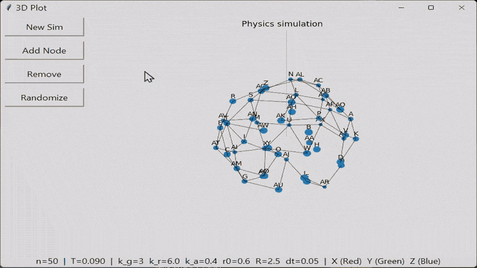

## Overview

Plot-Sandbox is a Python physics simulation that models how nodes organize themselves under competing forces. Each node experiences gravity toward a central focus, repulsion from neighbors, and spring attraction along explicit graph edges. The system evolves through simulated annealing until reaching equilibrium, revealing how weighted graph structures compress and self-organize in 3D space.



## How It Works

The project is layered so that domain data, physics, rendering, and UI have no cross-dependencies. The DOM holds node positions, weights, and edges as NumPy arrays and is the single source of truth. The physics engine reads those arrays and returns updated positions without knowing about the UI. Graph mutations are queued between physics steps to prevent race conditions. The 3D scene is rendered via VisPy and updated in place each frame. On GPU, a fused CUDA kernel replaces the per-force CuPy calls, cutting kernel launch overhead significantly for large graphs.

## Physics

Four forces act on each node every tick:

- **Central gravity** — constant-magnitude pull toward the focus point `[0, 0, 0]`, scaled by `gravity_ratio`. Uses a soft-core blend inside `soft_core_radius` to prevent singularities.
- **Pairwise repulsion** — pushes all nodes apart, scaled by `repel_ratio`. On CPU, a `cKDTree` limits computation to nodes within `repulsion_cutoff`. On GPU, repulsion is computed in row chunks to bound VRAM.
- **Pairwise attraction** — mild long-range pull between all node pairs, scaled by `k_attract`, also soft-core blended.
- **Edge springs** — Hooke's Law along explicit graph edges, scaled by `k_edge` with rest length `edge_rest_length`. Attractive when stretched, repulsive when compressed.

Temperature decays each tick by `cooling_factor` (simulated annealing). The simulation converges when mean displacement falls below `equilibrium_threshold`. All constants are live-editable in `config.json` and take effect immediately without restart.

## Running the Application

```bash
# Interactive GUI (PyQt6 + VisPy)
python main.py

# Reproducible initial layout
python main.py --seed 42

# Headless mode — no GUI, runs to convergence, saves NPZ
python main.py --headless --output-dir output/ --max-ticks 50000

# GPU device selection
python main.py --list-gpus          # list available CUDA devices
python main.py --cpu                # force CPU physics
python main.py --cuda-device 0      # run physics on a specific GPU

# Parameter sweep (grid search over headless runs)
python main.py --sweep --max-runs 50 --shuffle
```